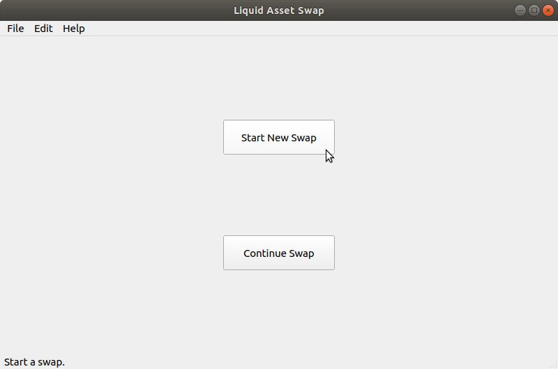
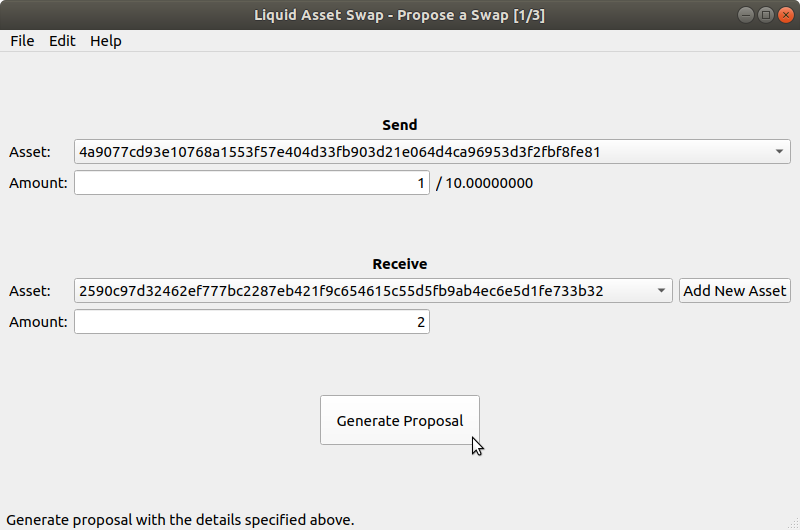
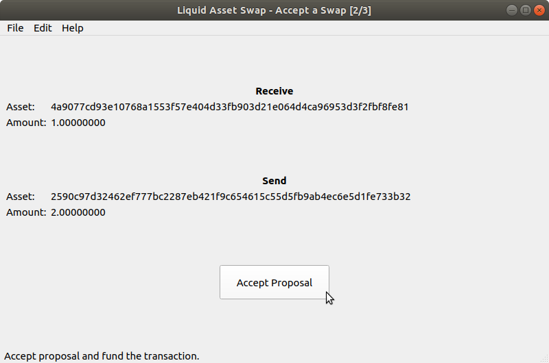
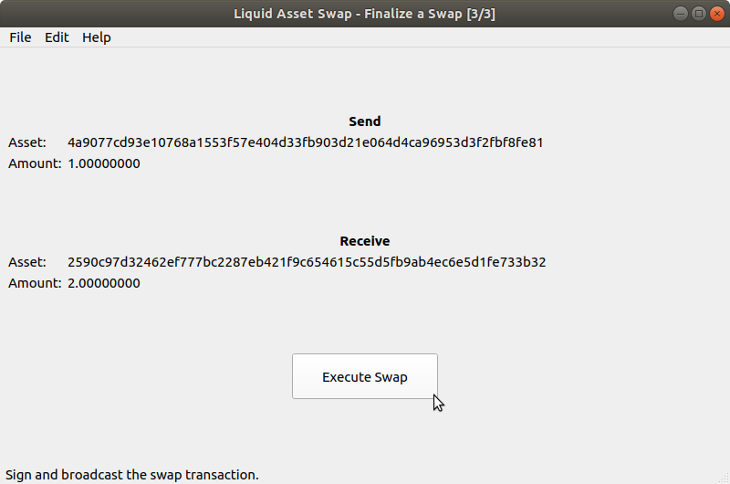

# Blockstream Liquid Swap Tool

This tool is intended to provide a simple standalone desktop app that enables
two parties to execute an atomic swap on the Liquid network, namely it allows them to
collectively construct a single transaction swapping the selected Issued Assets
between the parties.

## Getting started

To run the tool you need to have an instance of the Elements v0.17 daemon (elementsd) running.
You can download the latest Elements node binaries from the GitHub [repository](https://github.com/ElementsProject/elements/releases).

You can download the swap tool installers from the Liquid swap tool [release page](https://github.com/Blockstream/liquid-swap/releases), or you can install the tool from source.

The guide assumes that you are running using the Elements default configurations. If you are not using the defaults, refer to the [authentication](docs/authentication.md) page.

For more information and for troubleshooting see the [FAQ page](docs/faq.md).

### Running from source

The tool requires Python version 3.5 or greater.

Clone the repository and install GUI and CLI:
```
git clone https://github.com/Blockstream/liquid-swap
cd liquid-swap
pip install .
```

Run the GUI:
```
liquidswap-gui
```

Run the CLI:
```
liquidswap-cli
```

To run the Liquid swap tool in regtest mode, see the [regtest example page](docs/regtest-example.md). This page has instructions that show you how to run two instances of elementsd on the same regtest network, allowing you to test swaps with yourself.

## Executing a swap

From this point forward, we will refer to the person who initiates the trade as the __Proposer__ and the to the trading partner who either accepts or declines the Proposer's offer as the __Respondent__.

The Proposer defines trading conditions by pressing `Start New Swap` on the welcome window.



The Proposer then must select the desired assets and amounts to send and receive, then presses the `Generate Proposal` button.



The Proposer will be presented with an encoded message which contains
the proposed swap transaction data, which has to be sent to the Respondent.
The tool will allow the user to copy this message to the clipboard, or export it to a file so that it can be sent to the Respondent.

The Respondent will continue the trade by pressing `Continue Swap` on the welcome
window of their Liquid swap tool GUI, and pasting or importing the encoded swap message that was sent to them by the Proposer.

The Respondent can view the proposed swap and accept it by pressing by pressing `Accept Proposal`, which will give them the chance to review the fees that will be paid, along with the address that the received funds will be sent, before they confirm acceptance.



If they accept the swap, the Respondent will be presented with an encoded message
which contains the swap transaction data, which has to be returned to the Proposer.

If the Proposer wants to complete the swap they must press `Continue Swap` on the welcome screen and verify the contents of the trade.



If the Proposer accepts the trading conditions, they press `Execute Swap` and first confirm that they are willing to pay the fees needed for their part of the swap. If they accept the fees, the tool signs and broadcasts the transaction, completing the swap for both parties.

### Using the CLI
As an alternative to using the GUI, it is possible to use the command line to execute a swap.

The Proposer proposes a swap
```
liquidswap-cli propose ASSET_SEND AMOUNT_SEND ASSET_RECEIVE AMOUNT_RECEIVE --output proposal.txt
```

The Respondent analyzes the swap proposal
```
liquidswap-cli info proposal.txt
```

The Respondent accepts the swap proposal
```
liquidswap-cli accept proposal.txt --output accepted.txt
```

The Proposer analyzes the accepted swap proposal
```
liquidswap-cli info accepted.txt
```

The Proposer executes the swap by finalizing the accepted swap proposal
```
liquidswap-cli finalize accepted.txt --send
```


## Regtest
To use the tool locally against two regtest instances of Elements, follow
the [Regtest example](docs/regtest-example.md) instructions.

## Current risk and limitations
The tool is in its early days and should be considered experimental.

A swap is a transaction constructed by both parties that, once finalized, is
irreversible. The intermediate proposals exchanged contain information used to
create the swap transaction. This data includes private details, such as outputs
controlled by the wallet, thus proposals should be kept confidential among the
two parties.
It is recommended to use the tool with someone that you can trust to keep
such data private. Users are also encouraged to encrypt/sign messages sent
with their trading partners in order to mitigate against man-in-the-middle attacks.

A trade may take significant time to complete from when it was first proposed,
which means price assumptions made at the proposal stage of the swap may be
substantially different by the time the swap is finalized. Furthermore,
the Proposer (the one who starts the trade) can withhold broadcasting the transaction for
an indefinite amount of time after the Respondent (their trading partner), has accepted and signed their portion of the trade. Under this scenario,
the Respondent would be forced to double spend the swap outputs in order to
invalidate the trade order.

Also, at this moment you cannot swap assets within the same wallet. Swaps are limited to two parties and proposing multiple swaps at the same time may result in some of the swaps failing as the referenced UTXOs are currently not locked.

Finally, some choices were driven by wanting to have a simple first version of the tool, rather than a more functionally complete version. For instance, an accepted proposal contains the
receivers blinding keys, so the trading partner can fully unblind the
transaction. Sharing blinding keys exposes UTXO information that would
otherwise be hidden from third parties. For further information, you can read more on
[Confidential Transactions](https://elementsproject.org/features/confidential-transactions).

Once the tool is more established, we plan to overcome such compromises.

# Acknowledgments

Full credit list at [CREDITS.md](CREDITS.md).
